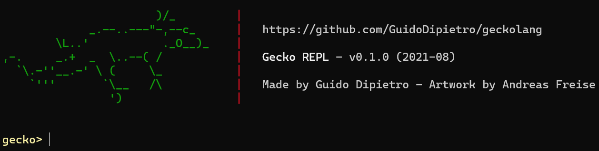
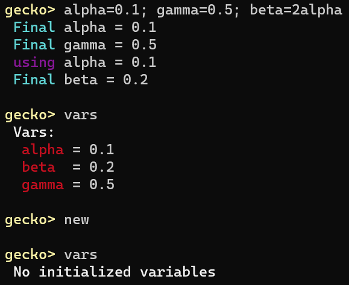

# Gecko



An interactive REPL devised for quickly getting calculations done.

# Features

<!-- Clean expr syntax -->
### Clean expression syntax
Write them as you would using pencil and paper (sort of).  
  

<!-- Straightforward piping for verbose expressions -->
### Straightforward piping for intricate expressions
Write down your math as it comes to your head!  
  
  
  

<!-- Built-in math functions -->
### Built-in math functions and constants
Wanna use `pi`? Just type `pi`. Wanna use `sin`? Just type `sin`.  
  

<!-- One-line function definitions -->
### Custom functions
Define your own functions, if you will!  
  
  
  
  

<!-- Complex numbers -->
### Complex numbers support
Gecko couldn't be less.  
  

<!-- ans -->
### Ans feature
This thing we all miss from scientific calculators...  
  

<!-- Calc command -->
### Calc command
No need to re-type the expression, just `calc` your variable again!  
  
  

<!-- Var dump -->
### Var dump
*Hmst*, I do wonder, what variables have I assigned so far?  
  

<!-- ONE LINE INTEGRATION -->
### Integrals
Bye-bye to WolframAlpha for scalar function integrals!  
  
  
  
  

<!-- PLOTTING -->
### Plots
Bye-bye to Desmos and GeoGebra for scalar function plots!  
  
  
  

### Expression reducer operator ("parentheses saver")
"Never press the left-arrow", says Gecko. This can save you a few keystrokes, if you wrap your mind around it.  
  

# Gecko REPL feature description

*"Let's break Gecko"*, they said.  
Here I provide a more complete (yet not at all technical) description of *all* of Gecko's features.

---

Statements are the big 'blocks' that make up _Gecko_.  
They are like commands that you enter to the REPL for _Gecko_ to eat. Like bugs. Yum.  
Multiple Statements are separated by a semicolon or by newline.  

Everything _Gecko_ understands is the following:

## Statements

I will list them, followed by an arrow like this `->` and the explanation of what they do.

- Any valid *expression* **(see next section)**
- **Variable assignments**
    - `a=5` -> **a=5**
    - `n1=n2=n3=15` -> **n1=15, n2=15, n3=15**
    - `value = 2*3 + 1` -> **value = 7**
    - `a = 5; b = 3+a` -> **b = 8**
- **Function definition**
    - `f(x,y) = x+y`
    - `g(x,y) = 2f(x,y)`
- **Plotting** an expression (see **Expressions**)  
    All these show a plot of the expression you write down, using `x` as the variable.
    - `plot x^2 from 0 to 5`
    - `f(x)=2x-5; plot f(x) from -10 to 10 as line1`
    - `plot rt(x) from 0 to 100 as "root of x"`
- **`calc` command**
    - `a=2; d=10a; a=5; calc d` -> **d = 50**
- **`polar` command**
    - `d=5+3j; polar d`, or
    - `d=5+3j; d polar`
    - Output: `5.831 @ 0.5404 rad (30.9638 deg)`
- **`vars` command**  
    shows all assigned global variables and their values
- **`new` command**  
    resets all variables and functions

## Expressions

I'll list all valid expressions, plus some examples of 'real-life' usage:

- **Numbers**
    - Real numbers, standard notation
        - `-3`
        - `14.27`
        - `0.2`
        - `.001`
    - Real numbers, scientific notation
        - `3e4`
        - `-2e-10`
        - `.02e3`
    - Complex numbers
        - `4+2j`
        - `-0.3j + 3`
        - `rt(-16)+1`
        - `3e5 + 5e10j`
    - Complex number - polar notation
        - `14@0.5pi`, absolute value `14`, angle `0.5pi` radians
        - `14 @ 0.5pi`
        - `14@<90`, absolute value `14`, angle `90` degrees
        - `14 @ <90`
        - `14 @< 90`
- **IDs**
    - Made from any combination of letters, numbers, and `_`, starting with a non-number. They can store a value, just like variables do in most programming languages (or any?)
    - Examples are `value, var1, total_result, n1, _1st_attempt`, etc.
- **Common binary operations:**
    - `+ - * / ^`
        - `5+3`
        - `0.2^3`
        - etc., you know this
- **Unary minus**:
    - `a=2; result = -a` -> **result = -2**
- **Built-in math functions and constants**
    - `sin, cos, tan`
        - inverse function by prepending `a-` (as in `asin`)
        - use degrees by appending `-d` (as in `tand`, `acosd`, etc.)
    - `ln rt angle abs deg rad` + `pi e tau` reassignable constants
        - **Bonus:** shorthand for `abs(x)` is `|x|`
- **Implicit multiplication**
    - `2x`
    - `5sin(4)`
    - `0.5(2+3)`
    - `6x^3`
    - `(x-5)(x+10)`
    - etc.
- **`with` expression**, when you feel like storing something in a variable but just for a bit
    - `2+a with a = 0.1` -> **2.1**
    - `2alpha+gamma with alpha=6, gamma=2` -> **14**
    - **Temporary variables assigned in `with` statements are not stored!**
- **`then` expression**, when you want to write down math as it comes to your head
    - `3^2+4^2 then rt(x)` -> **5**
    - `x = 10; result = 14-2^2 then 'var x/var'` -> **result = 1** (`var` could be replaced by any other valid ID)
- **Function calls**
    - `sum(x,y)=x+y; sum(5,6)` -> **11**
    - `mult(x,y)=x*y; square(x) = mult(x,x); square(10)` -> **100**
    - `double(x)=2x; double(double(3))` -> **12**
    - Notice: the **variables** and **functions** namespace is disjoint, meaning you can have a variable called `sum` with a value of `69`, and also a function called `sum` doing something else, with **no problems at all.** Not adviced, but works.
    - `sum=10; sum(x,y)=x+y; sum(sum,sum(sum,sum))` -> **30**
- **Integrals**
    - `int x from 0 to 5` -> **12.5**
    - `f(x)=sin(x); int f(x)+1 from 0 to pi` -> **5.1416**
- **$ operand** to save parentheses (you can ignore this if you don't get it now)  
    Basically, whenever Gecko finds a `$`, it just takes the bribe and reduces whatever you had already typed, as if you pressed 'Enter', but you can keep typing.
    - `1+2 $ * 10` -> **30**
    - `int x from 0 to 1 $ + int x from 4 to 5` == `(int x from 0 to 1) + (int x from 4 to 5)`
- **Special `ans` ID**, stores last printed value or 0
    - `a=10` -> **ans = 0**
    - `a=10; 15a` -> **ans = 150**
    - `sin(4^2); result = 10ans` -> **result = 10sin(4^2)**

# Motivation

As an engineering student, I've faced the task of repeating similar or identical calculations for problem solving way too often. Or just, a random piece of math I wanted to quickly solve and carry on doing something else. Maybe a simple plot I wanted to take a look at, or a silly single-variable integral.  

*Quickly* is the key here. I wanted to know the result as fast as possible, typing as little as I could, waiting the least as I could.  

Using a scientific calculator was not ideal. It was too slow and kinda awkward to type long expressions, usually low on battery, and I had to find it in the first place.  

The *Python* interpreter was alright, but I didn't like typing `**` for powers, `2*x` stuff, having to import the `math` module whenever I opened the terminal...  

Also, I couldn't use the `ANS` button that my scicalc had.  
Often, I found myself typing out formulas on-the-spot, having to go back and forth on the command line adding symbols.  

Plots? Type them on Google, or Desmos, or GeoGebra, or WolframAlpha. Same as integrals. Kinda slow, Internet connection dependant, and so on.

#### I mean, just look at this situation

Say I had to solve for `x` in `x² = a+b*c^15/9e9`.  
I would first type `a+b*c**15/9e9`. Then realise. Oh.  

I have to take the square root of all this.  
Go back.  
Hit the left-arrow key so many times.  
Add the `sqrt(` at the start. Ok.  
Then the `)` at the end.  

Nevermind. I didn't import the `math` module yet.  

*S L O W.*

My dream was something like:

```python
stuff_i_want = a+b*c**15/9e9 then sqrt(ans) # nothing like this available
```

Also, if I wanted to perhaps tweak the value of, say, `a`, I'd have to re-type all the equation, or find out where in the command history it was left.

Switching to the *Julia* <3 interpreter solved several of these issues, with its beautifully clean syntax, also adding new features such as:

```julia
f(x) = 2x^2+x-14 # Lovely, I just defined a function! (Lemme copy this syntax)
```

And I could use the pipe operator to imitate what I wanted to achieve - writing down the formula in the order that it came to my mind:

```julia
result = a+b*c^15/9e9 |> x->sqrt(x)
```

Gorgeous. A bit strange to type rapidly (`|> x->` would get my fingers entangled somewhat often), but it was pretty neat.

*Julia* also has built-in math functions, which I simply loved. No more `from math import *` at the start, or no more ugly `cos(radians(thing))`!!!! *AND* the `ANS` feature!!! What a beast.  

Still, no solution for the 're-calc' issue...  

And no way of finding roots for quadratic formulas quickly...  
Or just zeros of a function...  
Too many parentheses...  
No easy command to find the polar representation of a complex number...  
Not really any way to natively do plots...  
Neither easily calculating integrals...  

#### I had to take action.

This is when *Gecko* came to be. :lizard:

I decided to take all the features of the *Julia* REPL that I absolutely loved, and add to those my own needs (and dreams :neckbeard:).  
Aaand the nice looking Gecko ASCII art at the start. Credit to [Andreas Freise](http://www.ascii-art.de/) for it, it's super cute.  

# Thanks to

[David Beazley](https://www.dabeaz.com/) for the [Sly Lex Yacc](https://github.com/dabeaz/sly) tool. It is wonderful and really easy to use. Definitely couldn't (or wouldn't) have done this without it.

[Andreas Freise](http://www.ascii-art.de/) for the Gecko ASCII art.

[Julia](https://julialang.org/) creators for making that wonder. Many features of my REPL have been inspired in yours.

People in `ggg` for testing.

*Guido from the past* for making this.

*You* for reading. Thanks.